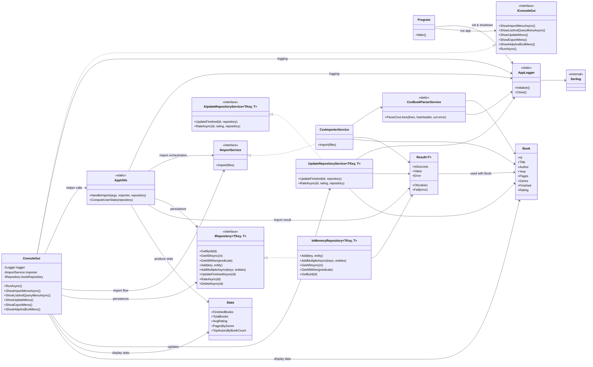

# ReadingList Class Dependency Diagram

This diagram highlights the core classes, interfaces, and how they depend on each other within the ReadingList application.

**Notes**
- `UpdateRepositoryService` is intended to implement `IUpdateRepositoryService`, but the current code references a non-existent `IUpdateRepository` type; aligning those names will restore the intended contract.
- External logging goes through Serilog via the static `AppLogger` facade.
